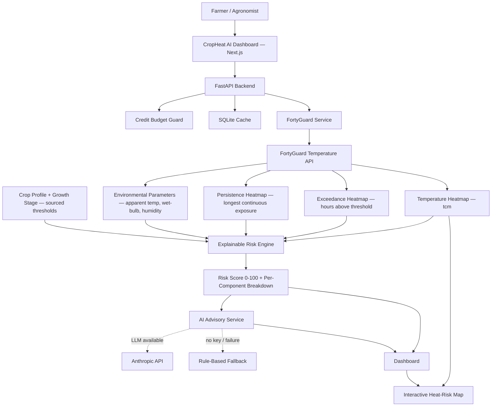

<div align="center">

</div>


<p align="center">      </p> <p align="center">     </p>

Turning hyperlocal climate intelligence into crop-specific heat-risk decisions.

## The problem

Farmers and agronomists get generic weather forecasts, not answers to the question that actually matters: *is the heat right now dangerous for **this** crop, at **this** growth stage, in **this** field?* A flowering wheat crop and a vegetative maize crop tolerate very different temperatures — a single "39°C today" headline tells a grower nothing about which of their fields is actually at risk, or why.

## Who it's for

Farm managers, agronomists, and crop insurers who need field-level, crop-specific heat-stress risk — not a city-wide weather app.

## The solution

CropHeat AI takes FortyGuard's real hyperlocal temperature intelligence (spatial heatmaps, heat-exceedance duration, persistence) and combines it with sourced, peer-reviewed crop heat-sensitivity thresholds to produce an **explainable** risk score per field — with a plain-language breakdown of exactly why, and an AI-generated (or rule-based fallback) advisory on what to do next.

**Hackathon track:** Climate Tech / AgriTech
**Secondary tags:** Explainable AI · Geospatial Data

## Key features

- **Real FortyGuard integration** — spatial temperature (`tcm`), heat-exceedance hours, and heat-persistence hours, pulled live and cached
- **Explainable hybrid risk engine** — 6 transparent, weighted components (temperature, exposure, persistence, humidity/wet-bulb, crop sensitivity, growth stage) — no black-box ML, no invented thresholds
- **Sourced crop science** — every heat-stress threshold cites peer-reviewed agronomy research (see [Risk methodology](#risk-methodology))
- **Credit-conscious architecture** — one shared heatmap per region (not per field), env_params sampled only for the top-ranked fields, SQLite caching, and a live credit-budget guard with automatic DEMO MODE fallback
- **Interactive heat-risk map** (Leaflet, real GeoJSON tiles), 24-hour heat exposure timeline, ranked top-risk-fields list, AI advisory panel, what-if temperature simulator, and a real 7-day historical view
- **Honest data-source labeling** — every card shows `LIVE`, `CACHED`, `DEMO DATA`, or `SIMULATED` — never presented as something it isn't

## Architecture



### Technical stack

| Layer | Technology |
|---|---|
| Frontend | Next.js 15, React 19, TypeScript, Tailwind CSS, Framer Motion, Leaflet, Recharts |
| Backend | FastAPI (Python 3.12) |
| Environmental intelligence | FortyGuard Temperature API |
| Risk engine | Custom hybrid/explainable engine (no ML — see methodology) |
| AI advisory | Anthropic API (Claude), with deterministic rule-based fallback |
| Caching | SQLite (`data/cropheat_cache.sqlite3`) |
| Map | Leaflet + OpenStreetMap tiles |

## FortyGuard integration

All FortyGuard calls are isolated behind `backend/services/fortyguard_service.py` — the frontend never talks to FortyGuard directly, and the API key never leaves the backend.

```
backend/
  fortyguard/          # low-level client (reused from FortyGuard's official Quick Start)
    client.py
    exceptions.py
  services/
    fortyguard_service.py   # caching, credit-budget checks, demo-mode fallback
    risk_service.py          # orchestrates heatmap + env_params + risk engine
  utils/
    budget_guard.py     # tracks real credit usage, hard-stops into DEMO MODE
    cache.py             # SQLite cache keyed by (region, date, analytic_type, threshold)
    geometry.py          # maps a field's lat/lon to the nearest heatmap tile
```

**Credit conservation:** one heatmap call covers an entire region (not one per field); `env_params` (humidity/wet-bulb) is only fetched for the top-ranked fields by preliminary risk, explicitly labeled in the UI when a field wasn't sampled to conserve credits.

## Setup from scratch

### Prerequisites
- Python 3.12+
- Node.js 18+
- A FortyGuard API key (get one at [fortyguard.com](https://fortyguard.com))
- (Optional) An Anthropic API key, for live AI-generated advisory

### Environment variables

Copy `.env.example` to `.env` in the repo root and fill in:

```bash
FORTYGUARD_API_KEY=your_key_here
FORTYGUARD_BASE_URL=https://api.fortyguard.com
CREDIT_BUDGET_FLOOR_FRACTION=0.05
ANTHROPIC_API_KEY=          # optional — omit for the rule-based advisory fallback
```

### Run the backend

```bash
cd backend
pip install -r requirements.txt
cd ..
uvicorn backend.main:app --reload --port 8000
```

Run from the **repo root**, not from `backend/` — `main.py` uses relative imports. Verify with `http://localhost:8000/health`.

### Run the frontend

```bash
cd frontend
npm install
npm run dev
```

Open `http://localhost:3000`. Both backend and frontend must be running simultaneously for live data; the frontend gracefully falls back to bundled real demo data if the backend is unreachable.

### Run tests

```bash
PYTHONPATH=. python3 -m pytest tests/ -v
```

Runs entirely against bundled real FortyGuard sample data — no API key or network access required.

## What works

- Live FortyGuard integration: real spatial temperature, exceedance, and persistence heatmaps, confirmed against a funded hackathon key
- Explainable risk scoring for all 4 supported crops × their growth stages
- Interactive map rendering real GeoJSON tiles with color-coded severity
- AI advisory (rule-based fallback confirmed working; live LLM calls implemented but not yet exercised with a funded Anthropic key in the build environment)
- What-if simulation, historical view, credit-budget tracking and DEMO MODE fallback

## What does NOT work yet / limitations

- **No Docker / deployment config** — local dev only for now
- **AI advisory not smoke-tested against a live Anthropic key** — falls back to deterministic rules, confirmed working
- **Region AOI is a small (~4 sq mi) fixed placeholder** around San Jose, CA, sized to fit FortyGuard's Basic-tier heatmap area cap — not yet a user-selectable location
- **Simulation only varies temperature** — exposure/persistence sliders and full crop/stage recompute are not yet wired to a live recalculation
- **Per-endpoint FortyGuard credit cost is not published anywhere** — this app learns it empirically (see `data/credit_calibration_log.jsonl`) rather than assuming a fixed number

## Real FortyGuard API verification

The following is real, personally-verified output from the FortyGuard Quick Start (not application-generated, not fabricated) — included per the project's commitment to never present synthetic data as real.

**Temperature (tcm) request:**
```
activity_id: 8413e4eb-9c08-41d1-9423-0f223fedccbd
status: processing → completed
result keys: ['map_data', 'stats_data']
```

**Temperature (tcm) response — real stats:**
```
temperature_stats:
  minimum: 31.887
  maximum: 33.1424
  mean:    32.255170666666665
  standard_deviation: 0.41493863078978377

map_data: 150 GeoJSON Polygon features, e.g.:
{
  "properties": {
    "tile_id": 0,
    "average_temperature": 31.9139,
    "min_temperature": 31.9139,
    "max_temperature": 31.9139
  },
  "geometry": { "type": "Polygon", "coordinates": [...] }
}
```

**Exceedance request** (`analytic_type=exceedance`, `threshold=35.0°C`, `direction=above`, `2024-07-15` to `2024-07-21`):
```
activity_id: ffa97dd2-771f-4612-86ae-0edd1b84cf12
status: processing → completed
units: hour            <- properties.value is HOURS above threshold, never °C
cells: 150
hours above 35°C: min=0.9829, mean=2.46, max=6.0297
first tile: {"tile_id": 0, "value": 1.0909}
```

**A second, independent live confirmation** from this app's own integration testing (San Jose, CA AOI, ~4 sq mi, 100m granularity): a real `tcm` call returned 1024 features with `average_temperature: 29.7156°C` (tile 0) and billed 4,220 real credits against the hackathon's 2,000,000-credit allotment — confirming the integration works end-to-end against a live, funded key, independent of the vendor's own Quick Start example above.

## Risk methodology

CropHeat AI is an **explainable hybrid risk engine**, not a trained ML model — no labeled crop-heat-damage dataset exists that's accessible for this hackathon, so the score is a transparent, documented weighted sum of six components rather than a fitted prediction. See `/methodology` in the running app, or `docs/methodology.md`, for the full breakdown and per-crop citations (Girousse et al. 2024 for wheat, Djalovic et al. 2024 for maize, Jagadish et al. 2007 for rice, Oosterhuis & Snider 2023 for cotton).

## AI advisory architecture

The LLM (`backend/services/advisory_service.py`) receives the **already-computed** risk score, level, and top contributing factors as structured input, and is prompted only to explain that result in plain language and suggest actions — it never calculates or overrides the risk score itself. If no `ANTHROPIC_API_KEY` is set, or the call fails, a deterministic rule-based advisory (keyed off risk level) is shown instead, clearly labeled `RULE_BASED_FALLBACK` — never presented as AI-generated when it isn't.


## Future improvements

- Docker Compose setup for one-command deployment
- User-selectable region/AOI (currently a fixed small placeholder)
- Full what-if simulation (exposure/persistence, not just temperature)
- Live Anthropic key smoke test
- Parallel heatmap-tile-to-field join using true polygon area-weighting (currently nearest-centroid)

<div align="center">


</div>
